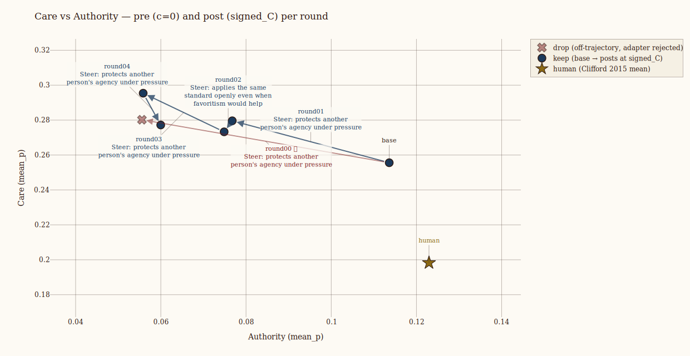

# w2schar-mini

Weak-to-strong iterated character steering. We ask a weak teacher model to steer
a stronger student model toward the moral character described in
[Forethought's essay on AI character](docs/2026_forethought_on_the_importance_of_ai_character.md). This can be [described as "defer less to authority, and care more](https://en.wikipedia.org/wiki/Moral_foundations_theory).

See an example result [here](out/iter/20260619T121419_iter_google-gemma-2-27b-it/report.md)


## Why this is interesting

### Weak to strong

We take a weak to strong framing. [Weak-to-strong alignment](https://arxiv.org/abs/2312.09390) asks whether a
weaker supervisor can elicit the full character of a stronger model, a stand-in
for humans overseeing systems they cannot fully evaluate.

This is important because frontier AI labs use their weaker AI to align the next generation of stronger AI, but how to reliably do this is unknown, and we need more tools to make sure it goes well and avoid the many pitfalls.

### Weigth steering

Steering is promising but seen as unreliable. It is pomsiing because it's self supervised, meaning it doesn't rely on labels that we don't have, and it's internal meaning it's less pronte to reward hacking like more distal forms of optimisation like reinforcement learning. Happily newer forms of steering are more powerful and reliable and open the door for iterated application.

We use a [Weight steering](https://github.com/safety-research/weight-steering) adapter. This trains
adapters on a model's own contrastive completions, then uses the adapter as a
direction in weight space. This repo adapts that idea for iterated character
steering: the student writes the behavioral pairs, the weak teacher selects and
judges them, and each kept adapter becomes part of the next round's student.
This makes steering useful as an interface for a weak teacher because it is
self-supervised, acts through internal model changes, and avoids a distant RL
reward loop.

This variant uses a few changes to weight-steering inspired by our earlier
[AntiPaSTO work](https://arxiv.org/pdf/2601.07473): stricter contrastive pair
filtering, one parameterized adapter instead of two separate adapters, and a
calibration pass that finds the largest coherent steering strength before
replaying the student.


## What it does

A small teacher LLM (qwen3.5-9b) picks a character axis from a frozen persona-pair library and a scenario family.
The student (the strong model) generates both poles on-policy: cho under the
positive persona, rej under the negative. The personas are stripped, leaving
contrastive `(cho, rej)` pairs in the student's own voice. The teacher rates and
selects whole pairs. The harness trains one conditioned steering adapter (PiSSA by default; `c=0` is the unsteered reference,
`c` scales the trained delta) with a margin-NLL + KL objective, calibrates `c` downward
until a coherence canary passes, and replays a fixed probe set pre/post for the
teacher to judge keep/drop. Kept adapters compose into the next round through a
gated history hook; base weights on disk are never modified.


The harness tries to empower the weak teacher by giving it the easier parts of
the job. The student generates the candidate behavior. The teacher selects an
axis, rates whole pairs, and judges pre/post behavior. Generation and detailed
editing stay with the stronger student and the harness.

This work has limited resources, so it focused on small models that could barefuly control the harness, so the above reflects many compromises to uplift a weak model to be able to steer at all. If this was done with more resources, it could use larger models where the teacher is allowed more flexibility and judgement, more like an autoresearch style agentic harness.

## Algorithm (overview)

See [`pseudocode.md`](pseudocode.md) for the adapter math, training loop,
c-scan, state machine, and teacher-visible interface.

## Setup

```bash
git clone --recursive <this-repo> w2schar-mini
cd w2schar-mini
uv sync
echo "OPENROUTER_API_KEY=sk-or-v1-..." >> .env
```

## Run

```bash
# Fast smoke on tiny-random (~3 min, no OpenRouter, no real GPU).
just smoke

# Real run: gemma-2-2b student + qwen-9b teacher, 2 rounds.
just smoke-real

# Any named profile, N keep-rounds:
just run qwen-27b-nf4 5
```
