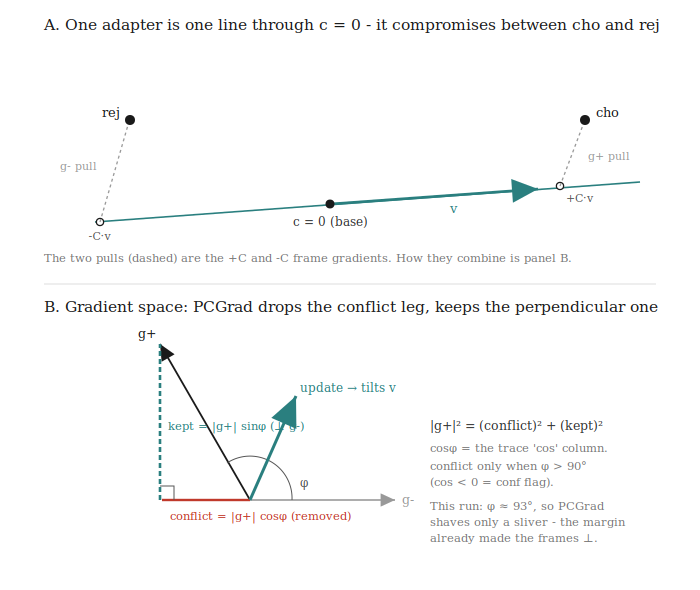

# What sets the steering direction

The contrastive weight-steering loss (`src/csm/ws/train.py`) learns a single
direction. This note pins down, directly: how much each pole contributes to that
direction, whether the contribution is computed in gradient or loss space, and
why exactly one of the four loss terms needs a normalization cap.

Panel A (behaviour space): the adapter is one line through `c=0` — a single
direction `v`, with `+C·v` aimed at cho and `-C·v` at rej. When base, cho and rej
are not collinear no line reaches both targets, so `v` settles at a weighted
compromise and the two ends fall short. Those two misses are the `+C` and `-C`
frame gradients, evaluated at the pinned `c` (so they are the oblique gap to the
target, not a perpendicular drop to the line).

Panel B (gradient space, where PCGrad acts): the two frame gradients sit at an
angle `φ`. PCGrad projects each off the other, which is a Pythagorean split of
`g+`:

$$\|g_+\|^2 = \underbrace{(\|g_+\|\cos\varphi)^2}_{\text{conflict, removed}} + \underbrace{(\|g_+\|\sin\varphi)^2}_{\text{kept, }\perp\,g_-}$$

`cos φ` is exactly the `cos` column in the training trace; PCGrad's surgery
(`conf=1`) fires only when `φ > 90°` (`cos φ < 0`). In the run above `cos`
drifts to ≈0 (`φ ≈ 93°`), so PCGrad shaves only a sliver — the contrastive
margin already drove the two frames near-perpendicular, which is the designed
behaviour. Which way the surviving update tilts `v` is set by the bounded CE
gradient magnitudes (next section): rej is the on-policy seed (`rej ≈ base`), so
`‖g-‖` is small and `v` leans toward cho.

## The direction lives in gradient space

The adapter is one weight-space direction `v` (the `B@A` factorization of one
LoRA). At `c=+C` the model adds `+C·(α/r)·BA·x`; at `c=-C` it adds the mirror.
So the model traces a line through `c=0`, and `v` is what we learn:

$$v \;\propto\; \Delta\theta \;=\; -\eta \sum_t g_t$$

the accumulated negative gradient. The direction is built in **gradient space**.
The nll *values* (the numbers in the trace) are loss space; they never add up
into the direction. Only the gradient vectors add.

## How much each pole contributes

Each step's move is a vector sum of four contributions:

- pull-cho, push-rej   (at `+C`)
- pull-rej, push-cho   (at `-C`)

Each tilts `v` in proportion to its gradient norm `‖g‖`, by vector addition.
Cross-entropy sets those norms. Per token the pull gradient at the label logit is

$$\frac{\partial\,\text{nll}}{\partial z_\text{label}} = p_\text{label} - 1,
\qquad |\cdot| = 1 - p_\text{label} \in [0, 1)$$

So every pull contribution sits in the same bounded band: a far target
(`p≈0.05`, nll~3) gives `≈0.95`; a near target (`p≈0.6`, nll~0.5) gives `≈0.4`.
The norm grows with distance but **saturates** — nll 3 and nll 30 both give `≈1`.
The loss value can be unbounded; the pull gradient norm cannot.

This is the crux: a big nll *value* is not a big nll *gradient*. Equal-ish
contribution to the direction therefore happens **for free in gradient space**.
Normalizing in loss space (dividing by nll) operates on the value, not the
gradient — it shrinks the already-bounded pull and hands the direction to the
wrong pole. That is the bug we removed.

The on-policy rej pole (the student's own seeded answer) contributes `≈0`,
because it is already at base: `p_rej≈1`, so `1-p_rej≈0`. Geometrically it is a
weak brake, not a driver. `v` is set by cho-pull against the two capped pushes.

## Is it Pythagoras?

For the **magnitude** of the combined step, yes, but only when the parts are
orthogonal:

$$\|g\| = \sqrt{\textstyle\sum_i \|g_i\|^2} \quad(\text{orthogonal case})$$

For the **direction**, no — that is the vector sum (parallelogram, tip-to-tail),
each part weighting it by its own `‖g‖`. Pythagoras only gives the length of the
orthogonal parts; it says nothing about which way the sum points. The two frames
are not generally orthogonal (`cho-pull` at `+C` and `cho-push` at `-C` act on
the same tokens with opposite sign); the between-frame angle is what PCGrad
measures and deconflicts.

## Why exactly one term needs a cap

A term needs a normalization cap iff it lacks a finite minimum — then its
gradient does not self-limit and θ runs to infinity.

| term | job | what bounds it |
|---|---|---|
| pull (cho/rej toward label) | learn the targets | CE itself: grad `= 1-p ∈ [0,1)`, self-limiting. **No norm.** |
| push (rej/cho away from label) | cancel shared fluency → contrast axis | nothing structural — see below. **One per-sample cap.** |
| reverse-KL anchor | coherence: don't invent modes base wouldn't | it *is* the bound (`kl_lambda`) |

The push (maximize nll, drive `p→0`) has no finite minimum, so without a cap a
single hard sample spikes `‖g‖` (task 101: ~5800) and, at `batch=2`, dominates
the batch direction and gets crushed-with-everything by `grad_clip`. So the push,
and only the push, is divided by its own detached nll (`_normed_mean`,
floored at 1).

### Why the KL anchor does not cover the push

It is tempting to think the reverse-KL anchor already bounds the push, making the
cap redundant. It does not. Our anchor is **reverse** KL,
`KL(p_steer ‖ p_base)`, which is zero-forcing: at any token where the adapter
drives `p_steer → 0`,

$$p_\text{steer}\,\log\frac{p_\text{steer}}{p_\text{base}}
\;\xrightarrow{\;p_\text{steer}\to 0\;}\; 0.$$

Dropping mass is ~free under reverse KL. But dropping rej's mass is exactly what
the rej-push does, so the anchor looks straight through it. Reverse KL was chosen
for the opposite job — it penalizes `p_steer` *adding* mass where base has none
(inventing modes = gibberish, the coherence failure the canary watches). Forward
KL `KL(p_base ‖ p_steer)` is mass-covering and *would* bound the push, but it has
the wrong coherence semantics (it forbids the model from ever suppressing
anything base would say, i.e. most of what steering does).

So the three terms each have one job and one bound, none redundant: pull bounded
by CE, push bounded by the per-sample cap, coherence bounded by reverse-KL. A
DPO-style `logsigmoid` margin would be a second, weaker-motivated way to bound
the push on top of a coherence principle we already express more directly.

## Empirical check

The symmetric cap (dividing all four terms by their nll) inverted the intended
balance: the on-policy rej-pull (nll<1, floored → unscaled) ran at full gradient
and learned from step 1, while the off-policy cho-pull (nll~3 → ×1/3) — the
actual behaviour change — stayed stuck at ~3. The push-only cap unsticks it
(gemma-27b, 120 steps):

| step | nll+ (cho) | nll- (rej) |
|---|---|---|
| 0 | 3.0 | 1.76 |
| 40 | 1.30 | 0.11 |
| 80 | 0.44 | 0.13 |
| 119 | 0.34 | 0.07 |

nll+ falls ~9x; both poles descend, so the adapter learns to *produce* cho, not
only suppress rej. `cos(g_nll, g_kl) → 0` (no tug-of-war on one axis) and PCGrad
fires through the back half (the `+C`/`-C` geometric tension being deconflicted).
